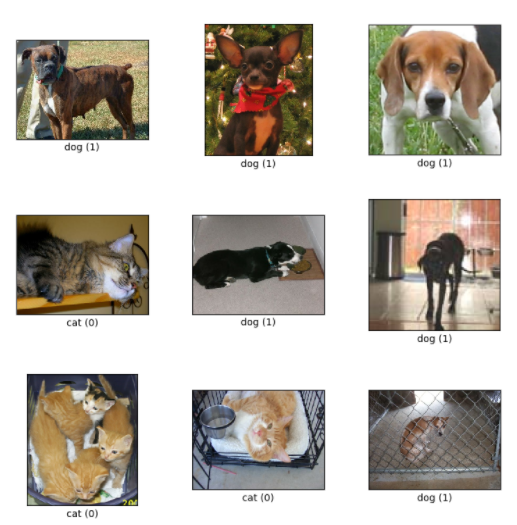
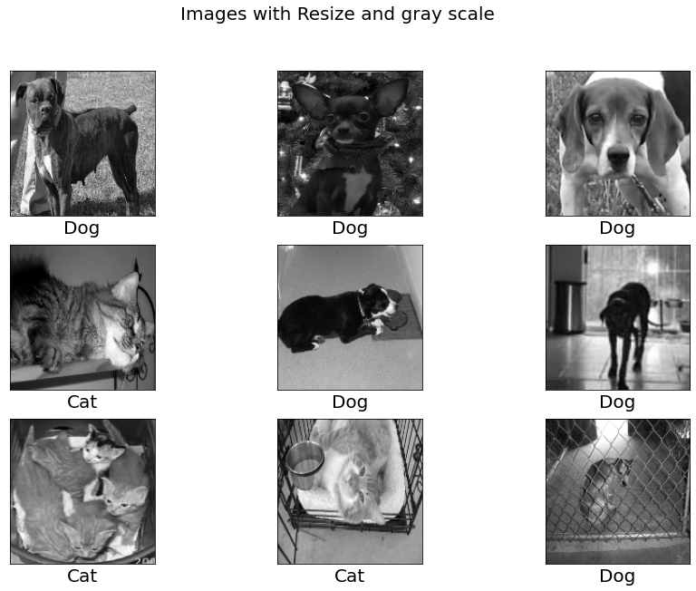
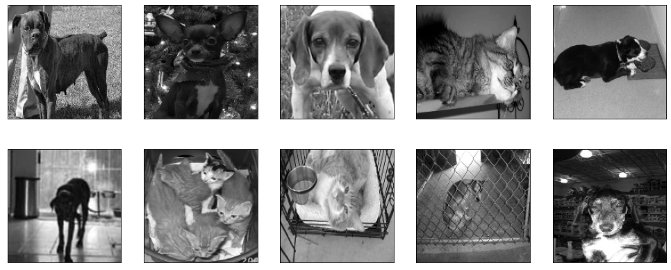
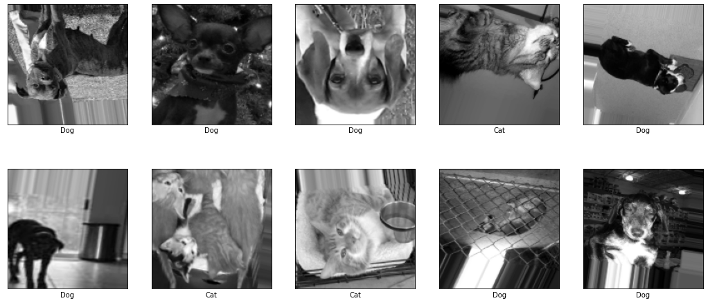
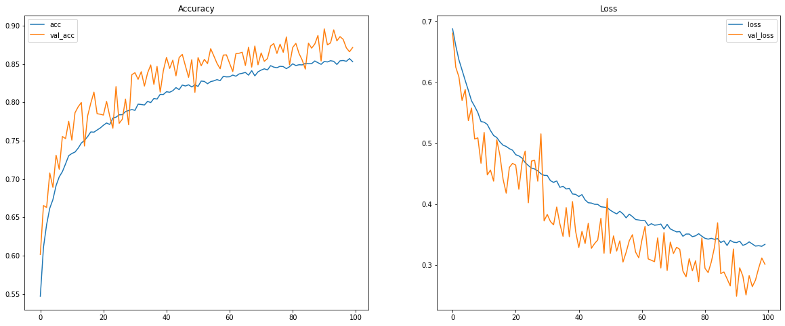

# Dogs and Cats Classifier

## Overview

This project use images of dogs and cats from [TensorFlow Datasets](https://www.tensorflow.org/datasets/catalog/overview?hl=es-419#all_datasets) to create a neural network that can classify the pictures in 2 classes, `Dog` or `Cat`.

## Dataset

The `cats_vs_dogs` dataset from tensorflow contains more than **23000** pictures of cats and dogs. It provides the data as supervised, ('image', 'label').



## Preprocessing

Change the size of the image because has we can see above, images have differrent sizes, the next size will be ***150x150*** for every image.

Second step is change the color to gray scale only because in this case the color is not very important to predict if the image contain a dog or cat.



At this point we have already completed most of the basic pre-processing, next we are going to perform ***data augmentation***, this will help the model learn more image combinations since we are going to generate images with some variations such as zooming, rotating, etc.

**These are the images before data augmentation:**



To perfomed data augmentation i'm going to use **ImageDataGenerator**. 

See the documentation in [TensorFlow](https://www.tensorflow.org/api_docs/python/tf/keras/preprocessing/image/ImageDataGenerator) to see all the parameters for this function.



## Convolutional Neural Network

```python
model = tf.keras.Sequential([
        tf.keras.layers.Conv2D(32, (3,3), activation="relu", input_shape=(IMG_SHAPE, IMG_SHAPE, 1)),
        tf.keras.layers.MaxPool2D((2,2)),

        tf.keras.layers.Conv2D(64, (3,3), activation="relu"),
        tf.keras.layers.MaxPool2D((2,2)),

        tf.keras.layers.Conv2D(128, (3,3), activation="relu"),
        tf.keras.layers.MaxPool2D((2,2)),

        tf.keras.layers.Dropout(0.5),
        tf.keras.layers.Flatten(),
        tf.keras.layers.Dense(100, activation="relu"),
        tf.keras.layers.Dense(1, activation="sigmoid")
])

model.compile(optimizer="adam",
              loss="binary_crossentropy",
              metrics=['accuracy'])

history = model.fit(full_train,
                    batch_size=32,
                    epochs=100,
                    validation_data=(X_test, y_test),
                    steps_per_epoch=int(np.ceil(len(X_train) / float(32))),
                    validation_steps=int(np.ceil(len(X_test) / float(32))),
                    callbacks=[tensorboard]
                    )
```


## Performance

This plots show the accuracy and loss of the model in training and validation. 



## Export Model

Finally, the last step is export the model using `TensorFlow JS`, this is a special format to be able to use it on web pages using Javascript.

```python
!tensorflowjs_converter --input_format keras cat_vs_dogs_model.h5 final_model
```


